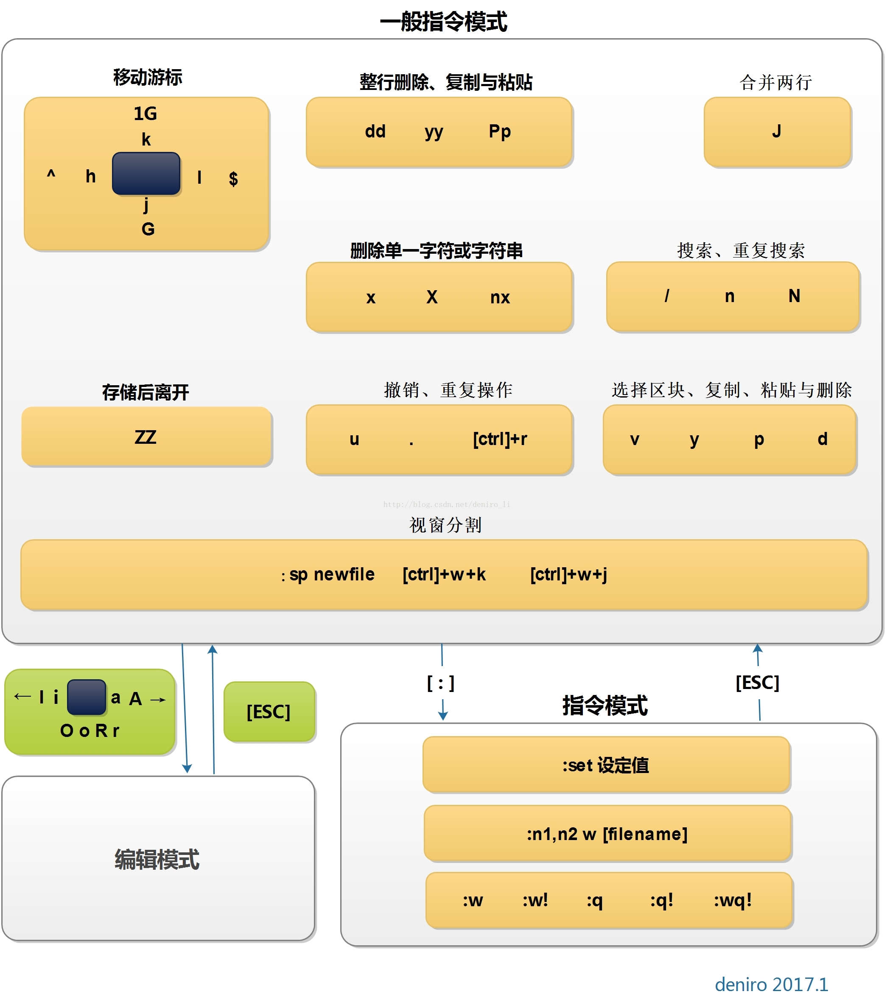

# vim 程序编辑器

> 作者：March    
> 链接：[vim 程序编辑器](https://github.com/maoqiqi/blog/blob/master/pages/os/vim.md)    
> 博客：http://blog.csdn.net/u011810138    
> 邮箱：fengqi.mao.march@gmail.com    
> 著作权归作者所有。商业转载请联系作者获得授权，非商业转载请注明出处。    

## 特点

* 所有的 UNIX Like 系统度会内置vi文本编辑器，其他的文本编辑器则不一定会存在。
* 很多软件的编辑接口都会主动调用vi；
* vim具有程序编辑能力，可以主动以字体颜色辨别语法的正确性，方便程序设计，vim可以视作vi的高级版本，
可以用颜色或底线等方式来显示一些特殊的信息。
* 程序简单，编辑速度相当快。

## 三种模式

* [一般模式](#一般模式)
  
  以vi打开一个文件就直接进入一般模式（默认的模式）。可以上下移动光标，删除字符或删除整行，也可以复制、粘贴你的文件数据，
  但无法编辑文件内容。
  
* [编辑模式](#编辑模式)
  
  按下"i ,I,o,O,a，A,r,R"等任一个字母之后才会进入编辑模式, 界面的左下方会出现INSERT或REPLACE的字样。
  再按下【Esc】按键即可退出编辑模式，回到一般模式。
  
* [命令行模式](#命令行模式)
  
  输入":,/,?"3个中的任一个按钮，就可以将光标移动到最下面那一行。此模式中，可以提供你的查找数据的操作，
  而读取、保存\大量替换字符、离开vi、显示行号等的操作则是在此模式中完成的。

## 进入vi界面

* `vi filename` 打开或新建文件，并将光标置于第一行首
* `vi +n filename` 打开文件，并将光标置于第n行首
* `vi + filename` 打开文件，并将光标置于最后一行首
* `vi +/pattern filename` 打开文件，并将光标置于第一个与pattern匹配的串处
* `vi -r filename` 在上次正用vi编辑时发生系统崩溃，恢复filename
* `vi filename....filename` 打开多个文件，依次进行编辑

## 一般模式

### 光标移动

* `h` 或 `←` 或 `Backspace` 光标左移一个字符
* `l` 或 `→` 或 `space` 光标右移一个字符
  * 如果想要向后面移动20个字符距离，可以使用`l`或`→`或`20space`的组合按键。
  
* `k` 或 `↑` 或 `Ctrl+p` 光标上移一行
* `j` 或 `↓` 或 `Ctrl+n` 光标下移一行
  * 如果想要向下移动30行，可以使用`30j`或`30↓`或`30Ctrl+n`的组合按键。

* `Home` 或 `0` 移动到这一行的最前面字符处
* `End` 或 `$` 移动到这一行的最后面字符处

* `gg` 移动到这个文件的第一行
* `G` 移动到这个文件的最后一行
  * 如果想要移动到这个文件的第20行，可以使用`20G`组合按键。

* `n[Enter]` n为数字。光标向下移动n行。

### 搜索（查找）

* `/abc` 从光标开始处向文件尾搜索abc
* `?abc` 从光标开始处向文件首搜索abc
* `/\/abc` 从光标开始处向文件尾搜索/abc，其中/是转义
* `n` 向下继续查找上一次搜索的内容
* `N` 向上继续查找上一次搜索的内容

### 替换

命令：`:[range]s/pattern/string/[c,e,g,i]`
* range 指的是范围。
* 1,7 指从第一行至第七行。
* 1,$ 指从第一行至最后一行，也就是整篇文章，也可以 % 代表。
* % 是目前编辑的文章。
* 是前一次编辑的文章。
* pattern 就是要被替换掉的字串，可以用 regexp 来表示。
* string 将 pattern 由 string 所取代。
* c confirm，每次替换前会询问。
* e 不显示 error。
* g globe，不询问，整行替换。
* i ignore 不分大小写。

例如：在100到200行之间查找abc并替换为ABC则用：`:100,200s/abc/ABC/g`。

基本使用
* `:s/abc/ABC/` 替换当前行第一个 abc 为 ABC。
* `:s/abc/ABC/g` 替换当前行所有 abc 为 ABC。
* `:n,$s/abc/ABC/` 替换第 n 行开始到最后一行中每一行的第一个 abc 为 ABC。
* `:n,$s/abc/ABC/g` 替换第 n 行开始到最后一行中每一行所有 abc 为 ABC。
  * 若 n 为 `.` ，表示从当前行开始到最后一行。
* `:%s/abc/ABC/` 替换每一行的第一个 abc 为 ABC。
* `:%s/abc/ABC/g` 替换每一行中所有 abc 为 ABC。
  * 可以使用 # 或 + 作为分隔符，此时中间出现的 / 不会作为分隔符。
    
    如：`:s#abc/#ABC/#` 替换当前行第一个 abc/ 为 ABC/。

### 删除

* `x` 在一行字当中，向后删除一个字符（相当于[Del]按键）。
* `X` 在一行字当中，向前删除一个字符（相当于[Backspace]按键）。

* `dd` 删除光标所在的那一整行。
* `ndd` 删除光标所在的向下n行，例如20dd则是删除20行。

* `d1G` 删除从光标所在到第一行的所有数据。
* `dG` 删除从光标所在到最后一行的所有数据。

* `d0` 删除从光标所在到该行的最前面第一个字符。
* `d$` 删除从光标所在到该行的最后一个字符。

### 复制

* `yy` 复制光标所在的那一行。
* `nyy` 复制光标所在的向下n行，例如20yy则是复制20行。

* `y1G` 复制从光标所在到第一行的所有数据。
* `yG` 复制从光标所在到最后一行的所有数据。

* `y0` 复制从光标所在到该行的最前面第一个字符的所有数据。
* `y$` 复制从光标所在到该行的最后一个字符的所有数据。

### 粘贴

* `p` 将已经复制的数据在光标下一行粘贴。
* `P` 将已经复制的数据在光标上一行粘贴。

### 其它

* `J` 将光标所在行与下一行的数据结合成一行。
* `u` 复原前一个操作
* `Ctrl + r` 重做上一个操作
* `.` 重复前一个操作

## 编辑模式

* i：在当前光标所在字符的前面，转为输入模式。
* I：在当前光标所在行的行首转换为输入模式。
* a：在当前光标所在字符的后面，转为输入模式。
* A：在光标所在行的行尾，转换为输入模式。
* o：在当前光标所在行的下方，新建一行，并转为输入模式。
* O：在当前光标所在行的上方，新建一行，并转为输入模式。
* r：替换光标处所在字符一次。
* R：一直替换光标所在的文字，直到按下[ESC]键为止。


## 命令行模式

* `:w` 将编辑的数据写入硬盘。
* `:w!` 若文件属性为"只读"时，强制写入该文件。
* `:q` 退出vi。
* `:q!` 若曾修改过文件，又不想存储，使用!为强制离开不保存文件。
* `:wq` 保存退出vi。
* `:wq!` 强制保存后退出vi。
* `:w filename` 另存为filename。
* `:n1,n2w filename` 将n1-n2行之间的内存另存为filename。
* `!comad` 暂时离开vi到命令行模式下执行comad的显示结果。

## vi环境的更改

* `:set nu` 显示行号。
* `:set nonu` 取消行号。

## vi的保存文件、恢复与打开时的警告信息

```
E325: ATTENTION <==错误代码
Found a swap file by the name ".a.txt.swp" <==下面的行数说明暂存文件的存在
          owned by: march   dated: Thu Jun 21 17:53:52 2018
         file name: ~march/go/blog/a.txt <==这个暂存属于哪个实际文件？
          modified: YES
         user name: march   host name: march.local
        process ID: 3712
While opening file "a.txt"
             dated: Thu Jun 21 17:10:03 2018
#下面说明可能发生这个错误的两个主要原因与解决方案
(1) Another program may be editing the same file.
    If this is the case, be careful not to end up with two
    different instances of the same file when making changes.
    Quit, or continue with caution.

(2) An edit session for this file crashed.
    If this is the case, use ":recover" or "vim -r a.txt"
    to recover the changes (see ":help recovery").
    If you did this already, delete the swap file ".a.txt.swp"
    to avoid this message.

Swap file ".a.txt.swp" already exists!
#下面说明你可进行的动作
[O]pen Read-Only, (E)dit anyway, (R)ecover, (D)elete it, (Q)uit, (A)bort:
```

由于暂存文件存在的关系，因此vim会主动的判断你的这个文件可能有些问题，在上面中vim提示两点主要的问题与解决方案，分别是这样的：

* 问题一：可能有其他人或程序同时在编辑这个文件。

  由于Linux是多用户多任务的环境，因此很可能有很多人 时在编辑同一个文件。如果在多人共同编辑的情况下，万一大家同时储存，
  那么这个文件的内容将会变的乱七八糟！为了避免这个问题，因此vim会出现这个警告窗口！解决的方法则是：
  * 找到另外那个程序或人员，请他将该vim的工作结束，然后你再继续处理。
  * 如果你只是要看该文件的内容并不会有任何修改的行为，那么可以选择打开成为只读（o)文件，其实就是[O]pen Read-Only的选项啦！
  
* 问题二：在前一个vim的环境中，可能因为某些不知名原因导致vim中断(crashed)。

  这就是常见的不正常结束vim产生的后果。解决方案依据不同的情况而不同！觉的处理方法为：
  * 如果你之前的vim处理动作尚未储存，此时你应该要按下“R”，亦可使用（R)ecover的项目，此时vim会载入.a.conf.swp的内容，
  让你自己来决定要不要储存！这样就能够救回之前未储存的工作。不过那个.a.conf.swp并不会在你结束vim后自动删除，
  所以你离开vim后还得要自行删除,才能避免每次找开这个文件都会出现这样的警告！
  * 如果你确定这个暂存文件是没有用的，那么你可以直接按下”D” 删除掉这个暂存文件，即（D)elete it这个项目。此时vim会载入a.conf，
  并且将旧的.a.conf.swp删除后，创建这次会使用的新的.a.conf.swp喔！
  
至于这个发现暂存盘警告信息的画面中，有出现六个可用按键，各按钮的说明如下：

* `[O]pen Read-Only` 打开此文件成为只读文件，可以用在你只是想要查阅文件内容并不想要进行编辑行为时。
一般来说，在上课时，如要你是登陆到同学的计算机去看他的配置文件，结果发现其实同学他自己在编辑时，可以使用这个模式。
* `(E)dit anyway` 还是用正常的方式打开你要编辑的那个文件，并不会载入暂存文件的内容。
不过很容易出现两个使用者互相改变对方的文件等问题！不好不好！
* `(R)ecover`  就是载入暂存文件的内容，用在你要救回之前未储存的工作。不过当你救回来并且储存离开vim后，
还是要手动自行删除那个暂存文件喔！
* `(D)elete it` 你确定那个暂存文件是无用的！那么打开文件前会先将这个暂存文件删除！这个动作其实是比较常做的！
因为你可能不确定这个暂存文件是怎么来的，所以就删除掉他吧。
* `(Q)uit` 按下q就离开vim，不会进行任何动作回到命令提示符。
* `(A)bort` 忽略这个编辑行为，感觉上与quit非常类似！也会送你回到命令提示符就是啰！

## 多文件编辑

```
vim a.txt b.txt
```

* `:n` 编辑下一个文件
* `:N` 编辑上一个文件
* `:files` 列出目前这个vim打开的所有文件

## 多窗口功能

`:sp`

## vim环境设置与记录: ~/.vimrc, ~/.viminfo

* `:set nu` `:set nonu` 就是设置与取消行号。
* `:set hlsearch` `:set hlsearch` 是否将查找的字符串反白的设置值。
* `:set autoiindent` `:set noautoindent` 是否自动缩排，autoindent就是自动缩排。
* `:set backup` 表示是否自动保存备份文件，一般是nobackup的，如果设置backup的话，那么当你改动任何一个文件时，
则原文件会被另存成一个文件名为filename~的文件。
* `:set ruler` 显示或不显示状态栏说明
* `:set showmode` 是否显示--INSERT--之类的字眼在左下角的状态栏。
* `:set backspace=(012)` 当backspace为2时，就是可以删除任意值；为0或1时，仅可删除刚才输入的字符，
而无法删除原本就已经存在的文字了。
* `:set all` 显示目前所有的环境参数设置值。
* `:set` 显示与系统默认值不同的设置参数，一般来说就是你有自行变动过的设置参数。
* `:syntax on` `:syntax off` 表示是否依据程序相关语法显示不同颜色。
* `:set bg=dark :set bg=light` 可以以显示不同的颜色色调，默认是light。

## vim 常用命令示意图



## 其它vim使用注意项

* 中文乱码的问题
* DOS与Linux的断行字符
* 语系编码转换
  * `iconv  --list` 列出iconv支持的语系数据
  * `iconv -f 原本编码 -t 新编码 filename [-0 newfile]`
    * -f: form， 后接原本的编码格式
    * -t： to, 即后来的新编码要是什么格式
    * -o file: 如果需要保留原本的文件， 那么使用-o 新文件名， 可以建立新编码文件。